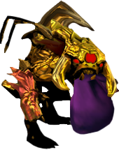

# Инструкция по разворачиванию проекта **"Серия успешных ставок"**

1.  Выкачать проект из **репозитория**;
2.  Создать Базу данных (скопировать таблицу);
3.  Прописать доступы к Базе данных (b/db.php -> $TableName);
4.  Записать новый ключ в файле  b/key.php в переменной $Key, после чего передать ключ ответственному лицу в DWH;
5.  В случае, если есть ограничения по участникам в акции, то необходимо внести их номера счетов в accounts.php. Если ограничений нет и в акции принимают участие все номера счетов, то необходимо очистить массив данных в переменной $Accounts;
6.  Наполнение контента;
7.  Тестирование.

*Проверить ссылки в шапке, должны быть абсолютными

Format: 

>>>>>  gd2md-html alert: inline image link here (to images/-0.png). Store image on your image server and adjust path/filename if necessary.  (<a href="#">Back to top</a>)(<a href="#gdcalert2">Next alert</a>) >>>>> 

